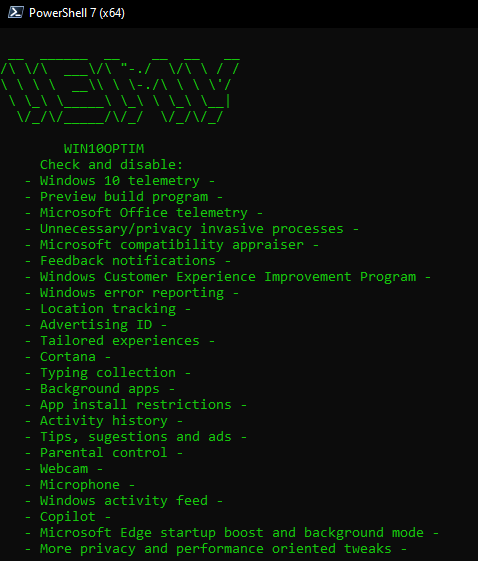

# Win10Optim




Win10Optim is an interactive PowerShell script designed to enhance the privacy and performance of Windows 10 by disabling registry keys, services and scheduled tasks.
This script includes the tweaks I regularly use in new installations for myself, so this is very much a personal project built for my specific needs, but it is easily editable and customizable for your own preferences.
The script focuses specially on limiting Microsoft Telemetry and not so much on debloating or uninstalling third-party apps, since I install Windows 10 N and spare myself from most bloatware that way.

## ⚠️ Disclaimer

I am not responsible for any damage, malfunction or undesired effects resulting from running this script in your system.
You will run the script on your own responsibility and under the assumption that you understand the changes that are being made.

## ❗ Important

- Executing the script as administrator is 100% necessary.
- Creating a registry backup and a restore point is **strongly recommended** (the script will offer the option to create both at the start) so you can revert the changes made in case of undesired results.
- This script is written for usage in modern PowerShell 7. I'm not sure it will work on Windows PowerShell or PowerShell 5.
- This script is interactive and will:
	- Inform you of the target setting to be modified
 	- Let you know your current setting
	- Ask you if you want to apply the proposed changes
- This is a privacy focused script and you might not want to apply every suggested change. Just to mention some examples, this script will suggest to:
	- Disable the microphone and webcam.
	- Disable indexing.
	- Disable all location services.
	
So please, don't rush to press **yes** to all, try to understand the changes you are making and use your backup in case something goes wrong. 

## 💻 Usage

1. Download win10optim.ps1 from the release section or the zip from the code button
2. Execute PowerShell as administrator.
3. Grant PowerShell the permission to run scripts from external sources:

```powershell
Set-ExecutionPolicy -ExecutionPolicy Unrestricted -Scope Process
```

4. Locate yourself in the directory containing the script and run it.
```powershell
.\win10optim.ps1
```

## 📣 Notice
This is not a finished project and I'm working on making the script much more descriptive so it's easier to understand the proposed modifications.
Many of the settings affected by the script are very explicitly describe by its own name and many of them are being described with comments on the script, so please take a look at it.